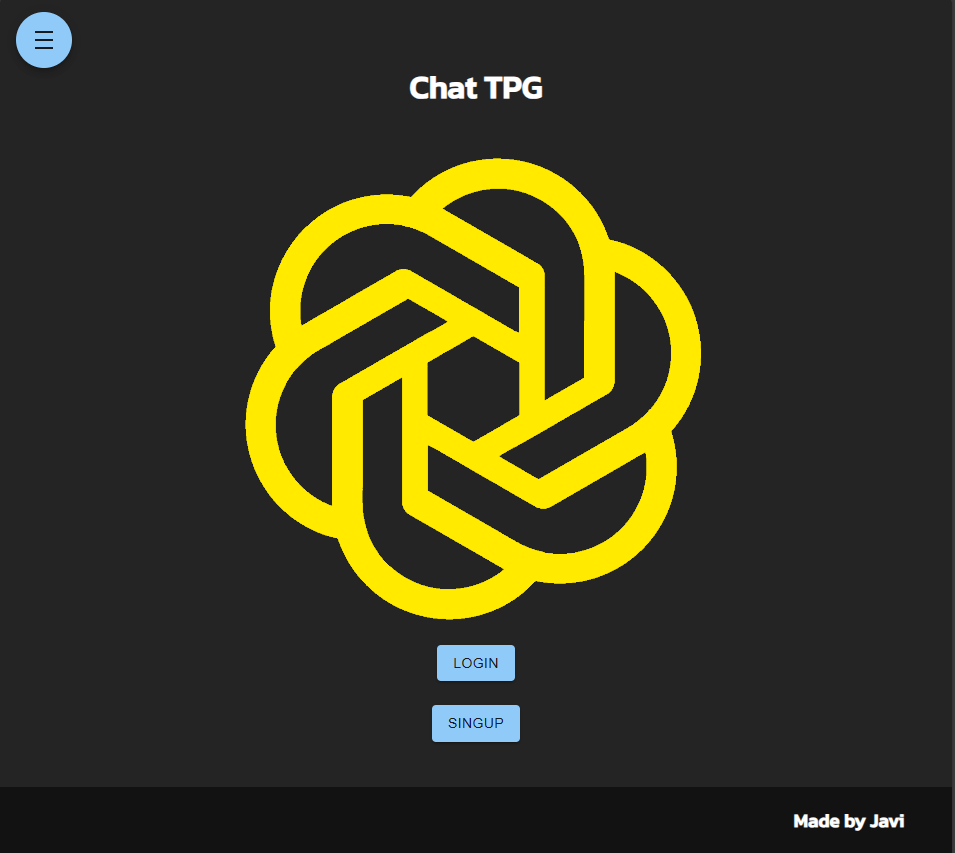
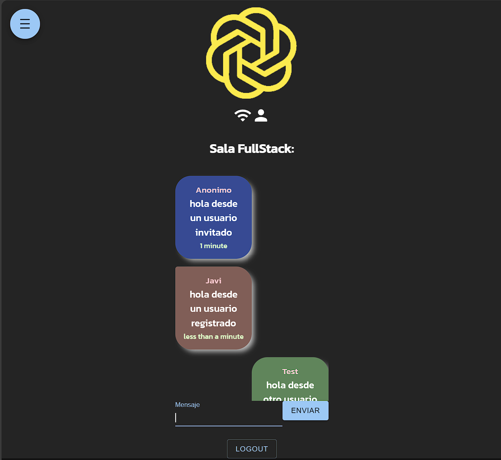

# MERN Chat APP

Flustack multi user messaging aplication using Mongo Express React Node.js 

Also this app uses:
- Cookies
- JWT
- Mongoose
- Material UI
- SASS
- WebSockets
- Docker

### RUNNING THE APP 

Get npm dependencies
```
npm install

cd  client 

npm install 

cd ..

```

Crate and Fill out '.env' file on project root dir

```
MONGO_URI=<mongo database uri>
MY_TOKEN_SECRET=<some secret string>
```

Run development enviroment
```
npm run dev

```

this app uses react scripts so it should automaticaly open webrowser, if not, open it and navigate to http://localhost:3000

### DEPLOY THE APP

this app has a dockerfile , it can be deploy on plattforms shuch as render , aws , Azure ...

there is an exapmle of render deployment -> [Chat TPG](https://chat-tpg.onrender.com)

### PANTALLA INICIAL



### PANTALLA CHAT

